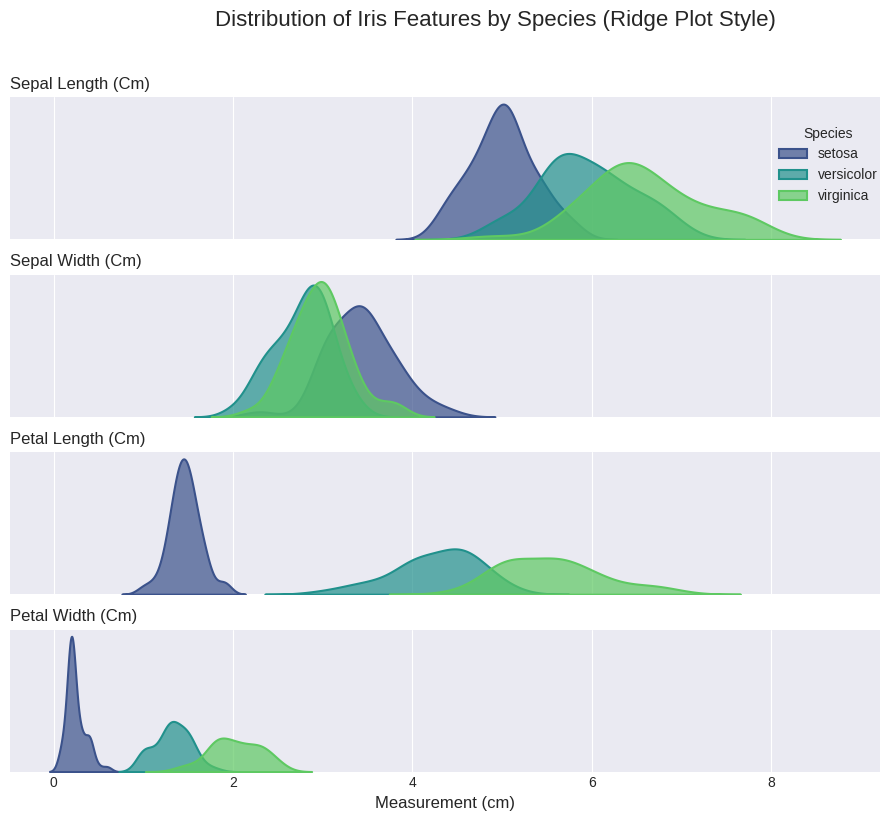
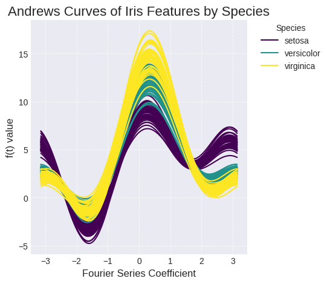
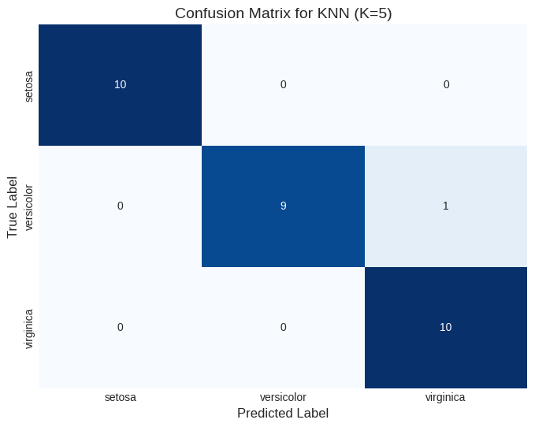

# KNN-Iris-Classification
This repository contains Python scripts for classifying the Iris dataset using K-Nearest Neighbors (KNN), as described in the Medium article 
"[KNN in Machine Learning (Project): From Concept to Classification with the Iris Dataset]".

## Structure
- `src/visualizations/`: Scripts for generating visualizations (e.g., pair plots, ridge plots).
- `src/model/`: Scripts for KNN model training and evaluation.
- `figures/`: Saved visualization outputs.

## Setup
1. Clone the repository: `git clone https://github.com/<your-username>/KNN-Iris-Classification.git`
2. Install dependencies: `pip install -r requirements.txt`
3. Run visualization scripts, e.g.: `python src/visualizations/pair_plot.py`

## Visualizations
### Pair Plot

Shows pairwise feature relationships by species.

### Ridge Plot

Provides a unique view of the distribution of each individual feature across the different Iris species.

### Andrews Curves

Transforms each data point into a unique curve, visualizing all four features simultaneously to highlight overall similarity and distinct class clusters.

## Model Evaluation

### Confusion Matrix

Provides a detailed breakdown of correct and incorrect predictions for each class, clearly showing how many instances were correctly classified and where the model made errors. This matrix directly reflects the model's accuracy and precision/recall across species.

## License
MIT License
