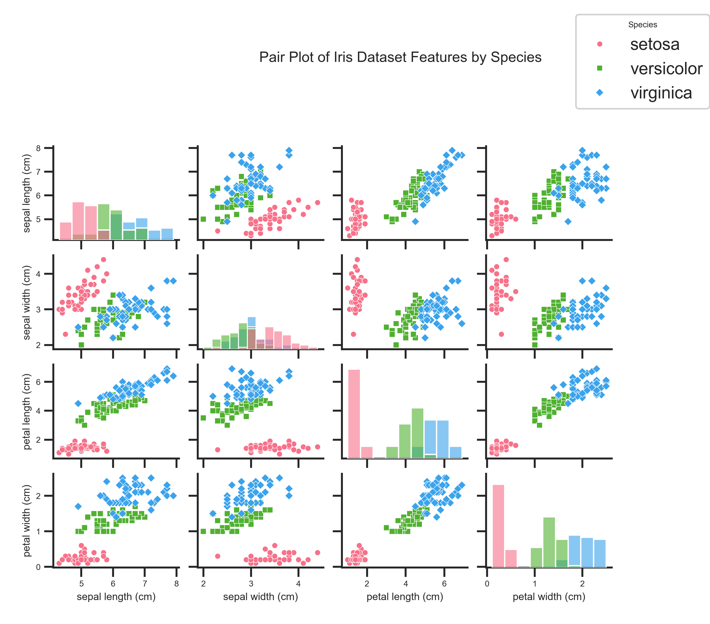

# KNN-Iris-Classification
This repository contains Python scripts for classifying the Iris dataset using K-Nearest Neighbors (KNN), as described in the Medium article 
"[KNN in Machine Learning (Project): From Concept to Classification with the Iris Dataset]".

## Structure
- `src/visualizations/`: Scripts for generating visualizations (e.g., pair plots, violin plots).
- `src/model/`: Scripts for KNN model training and evaluation.
- `figures/`: Saved visualization outputs.

## Setup
1. Clone the repository: `git clone https://github.com/<your-username>/KNN-Iris-Classification.git`
2. Install dependencies: `pip install -r requirements.txt`
3. Run visualization scripts, e.g.: `python src/visualizations/pair_plot.py`

## Visualizations
- Pair Plot: Shows pairwise feature relationships by species.
  

## License
MIT License
